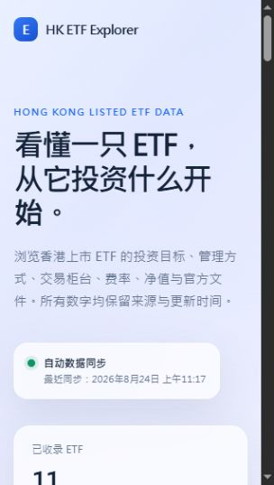
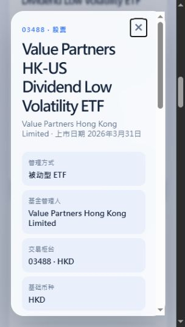

# HK ETF Explorer

面向香港上市 ETF 的公开资料采集与展示项目。项目将发行商分散的产品资料转换成可追溯、可筛选的数据，并通过 yfinance 补充延迟行情、日线 K 线、MA5 / MA20、成交量与估算资金动能。

> 资料仅供教育和信息展示，不构成投资建议。

在线网站（GitHub Pages）：[https://ttchen33.github.io/HK-ETF/](https://ttchen33.github.io/HK-ETF/)

## 界面预览

首页展示自动同步状态、ETF 数量、发行商、搜索筛选，以及净值、费用和资产规模等核心指标。



点击 ETF 卡片后，可查看管理方式、基金管理人、交易柜台、产品结构、NAV/AUM 与官方资料来源。



## 当前进度

- [x] 定义 ETF、交易柜台、每日快照和文件的标准数据结构。
- [x] 建立 Global X Hong Kong 的公开产品页自动采集器。
- [x] 通过公开 sitemap 自动发现 Global X 候选产品页。
- [x] 使用真实 ETF 完成首次端到端采集验证。
- [x] 加入字段校验、来源记录、原始快照和失败保护。
- [x] 配置工作日自动刷新工作流。
- [ ] 将 HKEX 当前 ETF 目录接入为“核对/发现”来源（不依赖受限制的动态接口）。
- [x] 接入第二家发行商：Value ETF（Value Partners）。
- [x] 建立可直接打开的 ETF 浏览网站，并读取统一资料目录。
- [x] 为当前 11 只 ETF 接入 yfinance 延迟行情与日线 K 线。
- [x] 建立独立的盘中行情定时更新流程，不重复抓取发行商产品页。
- [x] 建立 ETF 对比实验室：标准化收益、波动率、最大回撤、流动性、费用与规模。
- [x] 建立透明的数据可信度中心，并以独立测试覆盖核心金融指标和校验规则。

## 自动采集器

配置文件：`config/globalx-etfs.json` 与 `config/value-etfs.json`

```json
{
  "stockCode": "2837",
  "slug": "hang-seng-tech-etf",
  "expectedName": "Global X Hang Seng TECH ETF"
}
```

运行方式：

```powershell
<Node.js 路径> scripts/ingest-globalx.mjs
```

每次运行会：

1. 读取已配置的公开产品页。
2. 获取页面并保存本地原始快照（不提交到代码仓库）。
3. 解析、标准化和校验产品资料。正式更新模式会先从公开 sitemap 发现候选产品页，再以约 0.7 秒间隔逐页处理。
4. 输出各发行商的标准化资料，并由 `scripts/build-catalog.mjs` 生成 `data/catalog-latest.json` 与可直接由浏览器加载的 `data/catalog-latest.js`。
5. 页面请求或关键字段失败时输出错误，避免用空数据覆盖上一版有效数据。

## 自动运行

`.github/workflows/refresh-etf-data.yml` 会在工作日香港时间晚上运行。将项目推送到 GitHub 后，GitHub Actions 会自行运行 Global X 的公开目录发现与采集、Value ETF 的配置页采集，再重建统一资料目录；它不依赖开发者电脑持续开机。

`.github/workflows/refresh-market-data.yml` 在香港交易日约每 30 分钟运行。第一阶段只更新 `config/yfinance-symbols.json` 明确配置的 11 只 ETF；发行商产品目录即使自动发现更多基金，也不会未经验证直接扩大行情请求范围。脚本生成浏览器直接加载的行情文件。Yahoo Finance / yfinance 数据可能延迟或缺失，且只适合个人教育研究用途。

详见 [自动数据更新说明](docs/03-automatic-data-refresh.md)。

为避免一次性大量请求来源网站，首次本地验证可使用 `--limit=10`；部署后的工作流以限速方式处理完整候选目录。

## 数据口径

- **ETF 产品**：基金本身的投资目标、指数、管理方式、基础币种与派息说明。
- **交易柜台**：同一 ETF 的港币、美元、人民币柜台必须分开保存，避免混淆股票代码和交易币种。
- **每日快照**：净值、基金规模、费用和已发行单位按照官方披露日期保存为历史记录。
- **市场价格**：通过 yfinance 获取延迟或 K 线周期结束时的行情；它与基金净值不同，也不承诺交易级实时性。
- **估算资金动能**：将最新交易日的 5 分钟 K 线按上涨/下跌方向归类成交额，用于展示买卖动能；不是官方 ETF 申购赎回或真实资金流。
- **iNAV**：作为以后可选增强。它是盘中估算净值，而不是日终官方 NAV。

详见 [数据合同](docs/01-data-contract.md) 和 [来源字段映射](docs/02-source-field-mapping.md)。
来源选择的实际验证结果见 [数据源可行性结论](docs/04-source-feasibility.md)。
分析公式、比较窗口及透明评分规则见 [ETF 分析与数据可信度方法](docs/05-analytics-methodology.md)。
